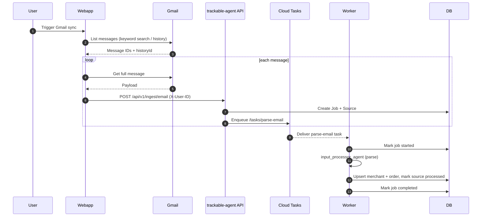
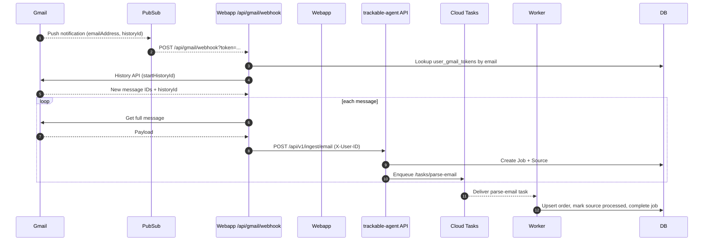
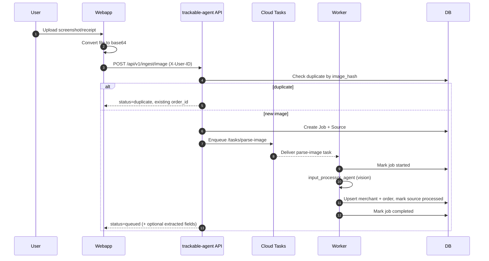

# Ingestion Codex

Trackable ingestion flows across the Next.js webapp and the trackable-agent backend.
This is a grounded map of the current code paths, not a product spec.

## Scope
- Email ingestion via Gmail (manual sync + push notifications)
- Screenshot/receipt ingestion (manual upload)
- Backend async processing (Cloud Tasks + Worker)

## Diagrams
### Email ingestion (webapp-driven Gmail sync)


### Email ingestion (webapp Gmail push notifications)


### Screenshot/receipt ingestion (webapp upload)



## System roles
- Webapp (Next.js): user auth, Gmail OAuth, Gmail API access, and proxying ingestion requests to trackable-agent.
- trackable-agent API: ingestion endpoints, job/source records, Cloud Tasks creation.
- trackable-agent Worker: async parsing for emails/images via input_processor_agent; order upsert logic.


## Email ingestion (webapp-driven Gmail sync)
### Entry points
- POST `/api/gmail/sync` in webapp: `src/app/api/gmail/sync/route.ts`
- GET `/api/gmail/sync`: returns status in webapp

### Flow
1) Webapp authenticates the user via Supabase and retrieves Gmail OAuth tokens.
   - Tokens are stored during OAuth callback in `user_gmail_tokens`.
   - Gmail watch auto-setup is attempted if `GMAIL_PUBSUB_TOPIC` is set.
2) Webapp decides sync mode:
   - Full sync: keyword search in Gmail.
   - Partial sync: Gmail History API using `last_history_id`.
   - Date-filtered sync: keyword search with `after:` when history expired.
3) Webapp fetches each Gmail message in full and extracts a text body.
4) For each message, webapp calls trackable-agent ingest:
   - POST `${TRACKABLE_API_URL}/api/v1/ingest/email`
   - Header: `X-User-ID: <supabase_user_id>`
   - Body: `{ email_content, email_subject, email_from }`
5) trackable-agent creates a Job + Source, then enqueues a Cloud Task to parse the email.
6) Worker processes the email and upserts an order (details in "Worker parsing").

### Key code references
- Gmail sync + history handling: `src/lib/gmail/sync.ts`
- Gmail OAuth client + token refresh: `src/lib/gmail/client.ts`
- OAuth callback + token storage: `src/app/api/auth/callback/route.ts`
- Webapp ingestion proxy to backend: `src/lib/trackable-agent/client.ts`
- trackable-agent ingest endpoint: `trackable/api/routes/ingest.py`

### Order keywords (Gmail search)
- `order confirmation`
- `your order`
- `order receipt`
- `purchase confirmation`
- `shipping confirmation`
- `has shipped`
- `order #`
- `tracking number`


## Email ingestion (webapp Gmail push notifications)
### Entry points
- POST `/api/gmail/watch` in webapp: set up Gmail watch
- POST `/api/gmail/webhook` in webapp: Pub/Sub push handler

### Flow
1) User enables watch: webapp calls Gmail `users.watch()` and stores `watch_expiration` + `watch_resource_id` in `user_gmail_tokens`.
2) Gmail publishes Pub/Sub notifications on new messages.
3) Pub/Sub pushes to webapp `/api/gmail/webhook?token=...` (token validated against `WEBHOOK_SECRET`).
4) Webhook looks up `user_gmail_tokens` by email, compares history IDs (BigInt compare), then:
   - Calls Gmail History API for new message IDs.
   - Fetches each message and calls trackable-agent `/api/v1/ingest/email` (same as manual sync).
5) Updates `last_history_id` and `last_sync_at`.
6) If history expired (404), webhook updates `last_history_id` only and exits (no message fetch).

### Key code references
- Watch setup: `src/lib/gmail/watch.ts`
- Webhook handler: `src/app/api/gmail/webhook/route.ts`
- Token storage: `user_gmail_tokens` table (webapp Supabase)


## Email ingestion (backend Pub/Sub -> Cloud Tasks)
### Entry point
- POST `/pubsub/gmail` in trackable-agent: `trackable/api/routes/pubsub.py`

### Flow
1) Pub/Sub notification is decoded and validated.
2) trackable-agent looks up `oauth_tokens` by provider email.
3) Creates a Job (`JobType.GMAIL_SYNC`) and enqueues a Cloud Task `/tasks/gmail-sync`.
4) Worker handler `handle_gmail_sync` currently logs and returns a placeholder result.

### Status note
- This backend Gmail sync path is wired but the Worker implementation is TODO.
- The webapp Gmail ingestion currently drives real ingestion by calling `/api/v1/ingest/email` per message.


## Screenshot/receipt ingestion (webapp upload)
### Entry points
- UI: "Add Order" modal (receipt upload)
- POST `/api/orders/upload` in webapp

### File validation
- Supported formats: PNG, JPG/JPEG, PDF
- Max size: 10 MB
- Encoding: Base64 (client-side)

### Flow
1) User drops a screenshot/receipt in the webapp.
2) Webapp converts the file to base64 and POSTs to `/api/orders/upload`.
3) Webapp proxy calls trackable-agent:
   - POST `${TRACKABLE_API_URL}/api/v1/ingest/image`
   - Header: `X-User-ID: <supabase_user_id>`
   - Body: `{ image_data, filename }`
4) trackable-agent validates + hashes the image, checks duplicates, creates Job + Source, then enqueues `/tasks/parse-image`.
5) Worker parses the image with the input_processor_agent and upserts an order.
6) The webapp uses any `extracted` fields in the immediate response to prefill the manual order form.
7) User confirms edits and submits the form, which calls webapp `POST /api/orders`.
8) Webapp proxies to trackable-agent `POST /api/v1/orders` when available; otherwise it returns a mock success (for development).

### Key code references
- Upload proxy: `src/app/api/orders/upload/route.ts`
- Upload UI + base64 conversion: `src/components/orders/add-order-modal.tsx`
- trackable-agent image ingest: `trackable/api/routes/ingest.py`
- Manual order create proxy: `src/app/api/orders/route.ts`


## Worker parsing (email + image)
### Entry points
- `/tasks/parse-email` and `/tasks/parse-image` in the Worker

### Shared flow
1) Cloud Task hits Worker endpoint.
2) Worker marks Job as started.
3) Worker constructs a prompt and invokes `input_processor_agent`.
4) Agent returns JSON; Worker parses into `InputProcessorOutput`.
5) First extracted order is converted to an Order model and upserted.
6) Source is marked processed and linked to the order.
7) Job is marked completed (or failed on error).

### Key code references
- Worker routes: `trackable/worker/routes/tasks.py`
- Worker handlers: `trackable/worker/handlers.py`
- Agent and conversion: `trackable/agents/input_processor.py`

### Image-specific behavior
- Duplicate detection uses SHA-256 hashes on image bytes in both:
  - API ingest path (`trackable/api/routes/ingest.py`)
  - Worker handler (`trackable/worker/handlers.py`)
- Duplicates return `status="duplicate"` with the existing `order_id`.

### Carrier normalization
Carriers are normalized to:
- `fedex`, `ups`, `usps`, `dhl`, `amazon_logistics`, `unknown`

### Order status lifecycle (backend)
`detected -> confirmed -> shipped -> in_transit -> delivered -> returned/refunded/cancelled`

### Order upsert merge strategy (backend)
- Status: only progresses forward (no regression).
- Items: replace when incoming has items.
- Money fields: overwrite when incoming provided.
- Confidence: keep higher score.
- Clarification questions: append without duplicates.
- Notes: append without duplicates.
- Refund fields: update when incoming provided.


## Ingest data model (trackable-agent)
### Jobs
- `trackable/models/job.py`: job records for queued/started/completed tasks.
- Jobs are created on ingest and updated when tasks are enqueued or completed.

### Sources
- `trackable/models/source.py`: records origin (email/screenshot), hashes, and processed status.
- Used for duplicate detection and linking orders to their origin.

### Orders
- `trackable/models/order.py`: `source_type` + `source_id` fields capture provenance.

### ExtractedOrderData schema (agent output)
```
merchant_name: string
merchant_domain?: string
merchant_order_id?: string
order_date?: datetime
order_total?: decimal
currency?: string
items: Item[]
tracking_number?: string
carrier?: string
confidence_score: float (0.0 - 1.0)
needs_clarification: boolean
clarification_questions: string[]
extraction_notes: string
```


## Batch ingest endpoints (backend)
### Email batch
- POST `/api/v1/ingest/email/batch`

### Image batch
- POST `/api/v1/ingest/image/batch`

Both endpoints loop over items, enqueue jobs independently, and return per-item status.
Reference: `trackable/api/routes/ingest.py` + `trackable/models/ingest.py`.

## Database tables (key columns)
### user_gmail_tokens (webapp Supabase)
- `user_id`, `email`
- `access_token`, `refresh_token`, `expires_at`, `scope`
- `last_history_id`, `last_sync_at`
- `watch_expiration`, `watch_resource_id`

### jobs (trackable-agent)
- `id`, `user_id`, `job_type`, `status`
- `input_data`, `result`
- `task_name`

### sources (trackable-agent)
- `id`, `user_id`, `source_type`, `processed`
- `gmail_message_id`, `email_subject`, `email_from`, `email_date`
- `image_hash`, `image_url`
- `order_id`

## Environment variables
### Webapp
- `TRACKABLE_API_URL`
- `GMAIL_PUBSUB_TOPIC`
- `WEBHOOK_SECRET`
- `GOOGLE_CLIENT_ID`
- `GOOGLE_CLIENT_SECRET`

### trackable-agent
- `GOOGLE_CLOUD_PROJECT`
- `GOOGLE_CLOUD_LOCATION`
- `CLOUD_TASKS_QUEUE`

## Error handling
- Gmail history expired (404): fall back to date-filtered sync.
- Duplicate image: return `status="duplicate"` with existing `order_id`.
- Low confidence: `needs_clarification=true` + questions.
- Missing order number: parsing raises error; job marked failed.
- Backend unavailable: webapp returns error, allows manual entry.

## Operational notes / gotchas
- trackable-agent expects `X-User-ID` and will auto-create the user if DB is connected.
- The webapp pushes Gmail emails directly to the backend; backend Gmail sync is wired but not implemented yet.
- Image ingestion returns `extracted` fields immediately, but the authoritative order creation happens asynchronously in the Worker.
